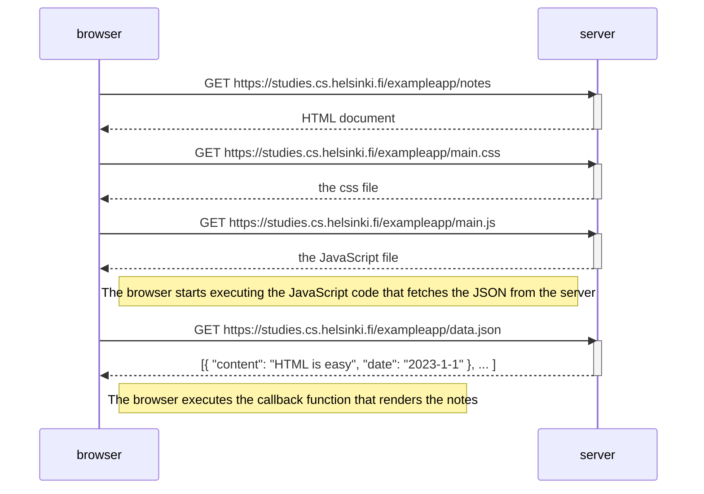
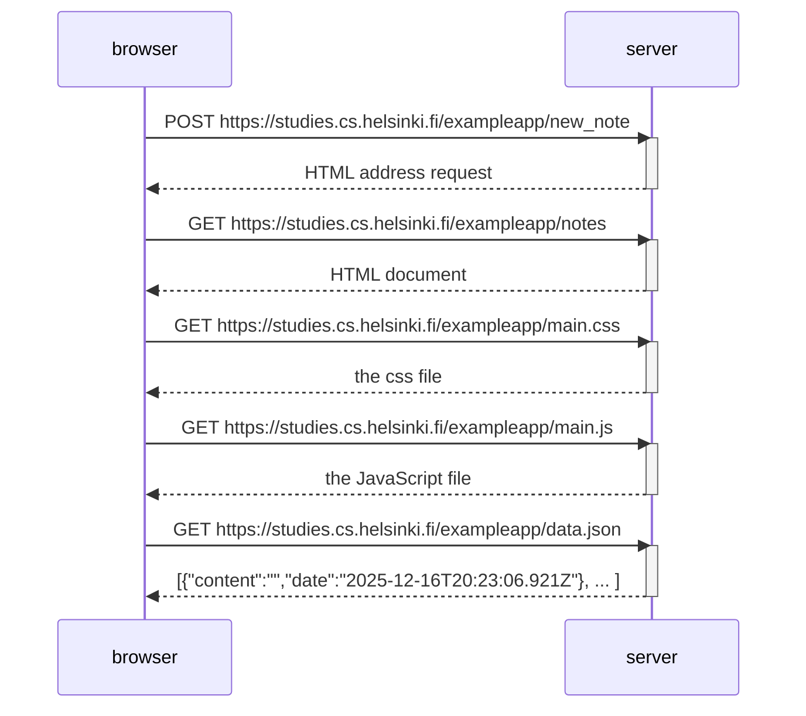

# Page Loading Sequence Diagram

This sequence diagram shows the chain of events when loading a page with JavaScript.



    Here is another SD depicting the a situation where an user creates a new note on https://studies.cs.helsinki.fi/exampleapp/notes
# Submiting Page Sequence Diagram

# Single Page Loading Sequence Diagram
same thing as Page Loading Sequence Diagram

# Submiting Page Sequence Diagram
```mermaid
sequenceDiagram
    participant browser
    participant server

    browser->>server: POST https://studies.cs.helsinki.fi/exampleapp/new_note_spa
    activate server
    server-->>browser: [{"content":"u wanna be edgy so bad","date":"2025-12-17T20:58:01.382Z"} ]
    deactivate server
